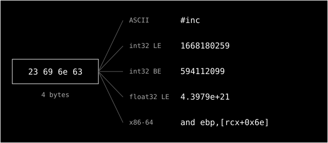

> **CSAPP series** — reading notes on _Computer Systems: A Programmer's Perspective_, one section
> at a time. Every post lives under [#csapp](/tags/csapp/).
> _[Leia em português](/posts/csapp-1-1-bits-e-contexto/)._

I started reading _Computer Systems: A Programmer's Perspective_ (Bryant & O'Hallaron, 3rd ed.).
The book opens with the most famous program in computing:

```c
#include <stdio.h>

int main()
{
    printf("hello, world\n");
    return 0;
}
```

Chapter 1 follows the life of this program: from the moment someone types it into an editor until
it prints a line and exits. The program is trivial, but every part of the system has to work
together for it to run. The first stop, section 1.1, fits in two pages and has a title that reads
like an equation: **Information Is Bits + Context**.

## What the book says

`hello.c` is a text file. To the disk, that means a sequence of **bits** grouped into 8-bit
**bytes**. Each byte is an integer, and the **ASCII** standard says which character each number
stands for: `#` is 35, `i` is 105, and the invisible newline `\n` is 10.

Files made only of ASCII characters are called **text files**. Everything else is a **binary
file**.

That leads to the key sentence of the section:

> All information in a system — including disk files, programs stored in memory, user data stored
> in memory, and data transferred across a network — is represented as a bunch of bits. The only
> thing that distinguishes different data objects is the context in which we view them.

The same sequence of bytes can be an integer, a floating-point number, a string or a machine
instruction. The section ends with a warning: machine numbers **are not** the integers and reals of
mathematics. They are finite approximations, and sometimes they behave in surprising ways. That
topic is left for chapter 2.

## Checking it myself

I opened `hello.c` with `od`, which prints each byte as a number:

```text
$ od -An -tu1 hello.c | head -2
  35 105 110  99 108 117 100 101  32  60 115 116 100 105 111  46
 104  62  10  10 105 110 116  32 109  97 105 110  40  41  10 123
```

These are the same numbers as Figure 1.2 in the book. You can also see the two `10`s in a row
after `#include <stdio.h>`: the line break and the blank line.

Then I took only the first four bytes, `23 69 6e 63`, and read them in five different ways:

| Read as...                   | They mean                       |
| ---------------------------- | ------------------------------- |
| ASCII text                   | `#inc`                          |
| `int32` little-endian (x86)  | `1668180259`                    |
| `int32` big-endian (network) | `594112099`                     |
| `float32` little-endian      | `4.3979 × 10²¹`                 |
| x86-64 instruction           | `and ebp, DWORD PTR [rcx+0x6e]` |



The last result came from `objdump`, which accepted the start of an `#include` as valid machine
code:

```text
$ head -c 8 hello.c > b.bin
$ objdump -D -b binary -m i386:x86-64 -M intel b.bin
   0:  23 69 6e        and    ebp,DWORD PTR [rcx+0x6e]
   3:  63 6c 75 64     movsxd ebp,DWORD PTR [rbp+rsi*2+0x64]
```

The four bytes are the same in every row of the table. The only thing that changed was how they
were read.

## Bits do not carry their own meaning

This is the philosophical part, and I think it is the most important idea in the section.

A byte does not know what it is. The number 35 is not "a `#`". It only becomes `#` because I, my
editor and the committee that created ASCII in 1963 agreed to read it that way. The meaning is not
in the data. It lives in an agreement **outside** of it: in the type the compiler knows, in the
file extension, in a protocol header, in the documentation, in the programmer's head.

This echoes an old idea from linguistics: the sign is arbitrary. Nothing in the word "tree" looks
like a tree, and nothing in the pattern `00100011` looks like a `#`. The difference is that, in a
computer, the agreement has to be explicit and exact. A person reading a text full of typos still
gets the point. A CPU executing text bytes has no way to notice that something is wrong.

Even the split between "text" and "binary" is a human category. To the machine, everything is
binary. "Text" is just the binary we agreed to read through the ASCII table.

## Many bugs are context errors

The pragmatic side: once you start thinking in "bits + context", you see the same kind of error in
many places.

- **Mojibake.** UTF-8 text read as Latin-1 turns `café` into `café`. The bytes are right; the
  table used to read them is wrong.
- **Endianness.** Send an `int` over the network without `htonl` and the other side reads
  `594112099` when you sent `1668180259`.
- **Floating point.** `0.1 + 0.2` gives `0.30000000000000004`. The real value was approximated by
  the IEEE 754 format.
- **Overflow.** In `int32`, `2147483647 + 1` wraps around to `-2147483648`. In C, with signed
  integers, this is _undefined behavior_, which is even worse.
- **Code injection.** A buffer overflow works because, in memory, data and instructions are made of
  the same stuff. If an attacker gets the CPU to treat their data as code, those bits get executed.
  Protections like NX and W^X are a way to impose context on memory: "this region is for reading,
  this one is for executing".

In all of these cases the bits are correct. What is wrong is the interpretation.

## Abstraction is context on top of context

Seen this way, a whole system is a stack of contexts:

```text
bits → bytes → characters → tokens → syntax tree → instructions → process
```

Each layer takes the one below and reads its data in a new way. The compiler, which shows up in
section 1.2, is basically a machine that swaps one context for another: it reads bytes as C and
writes bytes as x86. We call it an **abstraction** when a context is stable enough that we can stop
thinking about the layer below.

The book exists because these abstractions sometimes break. When a `float` doesn't add up or an
`int` turns negative, that is the lower layer showing through. A programmer who only knows the top
layer sees magic, or an "impossible" bug. Someone who knows the bits underneath just sees a context
that changed.

## Takeaways

1. Data alone says nothing. Always ask what the context is: type, encoding, byte order, format.
2. Make the context explicit. Use strong types, declare the charset, document formats and put magic
   numbers at the start of files. Implicit context tends to become a bug later.
3. Be suspicious of boundaries. The network, the disk, FFI and `memcpy` are places where bits cross
   from one context to another, and that is where the interpretation usually gets lost.

For a two-page section, that was a lot. Next stop: 1.2, where `hello.c` is translated by other
programs until it becomes an executable.
