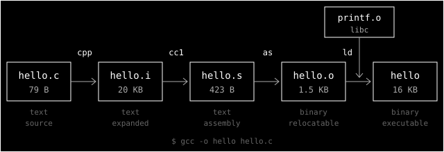

> **Série CSAPP** — notas de leitura de _Computer Systems: A Programmer's Perspective_, uma seção
> por vez. Todos os posts ficam em [#csapp](/tags/csapp/). Anterior:
> [§1.1 — Bits + contexto](/posts/csapp-1-1-bits-e-contexto/).
> _[Read in English](/posts/csapp-1-2-programs-translated/)._

Na [seção anterior](/posts/csapp-1-1-bits-e-contexto/), o `hello.c` era só uma sequência de bytes
ASCII num arquivo. Ele está em C porque, nessa forma, uma pessoa consegue ler e entender o que ele
faz. A CPU não entende C. Para rodar, o programa precisa ser **traduzido por outros programas** até
virar instruções de máquina, empacotadas num **executável**.

A seção 1.2 é sobre essa tradução. Ela cabe num comando:

```text
$ gcc -o hello hello.c
```

## O que o livro diz

O `gcc` é um **compiler driver**: ele não faz o trabalho sozinho, mas chama quatro programas em
sequência. Juntos, eles formam o **sistema de compilação**:



1. **Pré-processamento (`cpp`).** Trata as linhas que começam com `#`. O `#include <stdio.h>` é
   trocado pelo conteúdo do arquivo `stdio.h`. O resultado, `hello.i`, ainda é um programa C.
2. **Compilação (`cc1`).** Traduz o C em **assembly**, o `hello.s`: um arquivo de texto com uma
   instrução de máquina por linha. O livro observa que o assembly serve de linguagem de saída comum:
   compiladores de C e de Fortran geram o mesmo assembly.
3. **Montagem (`as`).** Traduz o assembly em código de máquina e o guarda num **objeto relocável**,
   o `hello.o`. Esse arquivo já é binário: num editor de texto, parece lixo.
4. **Ligação (`ld`).** O `hello.c` chama `printf`, que não está nele. Ela vem da biblioteca padrão
   de C, num objeto pré-compilado. O **linker** junta as duas partes e gera o executável `hello`,
   pronto para ser carregado na memória.

A seção traz ainda um aside sobre o **projeto GNU**, criado por Richard Stallman em 1984 para
construir um sistema parecido com o Unix e totalmente livre. O GNU fez tudo menos o kernel (que
veio do Linux): emacs, gcc, gdb, assembler, linker. O livro lembra que o movimento open source deve
sua origem intelectual a essa ideia de software livre, _"free as in free speech, not free beer"_.

## Conferindo na prática

Dá para parar o `gcc` em cada fase e olhar o resultado. Fiz isso com o gcc 16 num Linux x86-64:

```text
$ gcc -E hello.c -o hello.i       # só pré-processa
$ gcc -S -Og hello.c -o hello.s   # para no assembly
$ gcc -c -Og hello.c              # para no objeto relocável
$ gcc -Og hello.o -o hello        # só liga
```

O tamanho de cada forma já conta uma história:

| Arquivo   | Tamanho | O que é                                          |
| --------- | ------- | ------------------------------------------------ |
| `hello.c` | 79 B    | 7 linhas de C                                    |
| `hello.i` | 20 KB   | 845 linhas: o `stdio.h` inteiro colado no começo |
| `hello.s` | 423 B   | assembly em texto                                |
| `hello.o` | 1.5 KB  | ELF relocável; a `main` ocupa 26 bytes           |
| `hello`   | 16 KB   | ELF executável (837 KB se ligado com `-static`)  |

O assembly é quase o mesmo do livro:

```asm
main:
    subq    $8, %rsp
    leaq    .LC0(%rip), %rdi
    call    puts@PLT
    movl    $0, %eax
    addq    $8, %rsp
    ret
```

Olhando com calma, aparecem quatro coisas que o livro simplifica ou que mudaram desde 2016.

**O `printf` virou `puts`.** Eu escrevi `printf("hello, world\n")`, mas o assembly chama `puts`. O
compilador sabe que um `printf` sem nenhum `%` e terminado em `\n` faz o mesmo que um `puts` da
string sem o `\n`, e o `puts` é mais barato. A troca acontece até com `-O0`. Só com
`-fno-builtin` a chamada continua sendo `printf`.

**O `cpp` não aparece como processo.** O `gcc -v` mostra cada programa que o driver chama. Hoje a
lista é `cc1` → `as` → `collect2` (que chama o `ld`). O pré-processamento acontece dentro do `cc1`.
As quatro fases continuam existindo, mas como etapas lógicas, não necessariamente como programas
separados.

**A `main` tem 26 bytes, e não 17.** Executáveis no Linux moderno são **PIE** (_position-independent
executables_) por padrão. Por isso a string é endereçada em relação ao `%rip`: `leaq .LC0(%rip)`
ocupa 7 bytes, contra os 5 do `movl $.LC0` do livro.

**Não existe `printf.o` sendo copiado para dentro.** O executável é ligado **dinamicamente**:

```text
$ nm hello | grep puts
                 U puts@GLIBC_2.2.5
$ ldd hello
        libc.so.6 => /usr/lib/libc.so.6
        /lib64/ld-linux-x86-64.so.2 => /usr/lib64/ld-linux-x86-64.so.2
```

O `U` quer dizer _undefined_. Mesmo depois do `ld`, o `puts` ainda não está no arquivo. Quem
resolve esse símbolo é o `ld-linux`, na hora em que o programa é carregado. A ligação ficou dividida
em duas etapas, uma no build e outra no `exec`. O livro deixa esse detalhe para o capítulo 7.

## Zeros esperando sentido

A parte que mais gostei de ver foi a relocação. No `hello.o`, as instruções que dependem de
endereços estão com **zeros** no lugar:

```text
$ objdump -d -r hello.o
   4:  48 8d 3d 00 00 00 00   lea    0x0(%rip),%rdi
                      7: R_X86_64_PC32   .LC0-0x4
   b:  e8 00 00 00 00         call   10 <main+0x10>
                      c: R_X86_64_PLT32  puts-0x4
```

O assembler não sabe onde a string e o `puts` vão parar, então deixa o espaço em branco e anota um
**registro de relocação**: "no byte 7, coloque o endereço de `.LC0`; no byte 12, o de `puts`". No
executável, o linker preencheu esses campos:

```text
$ objdump -d hello
  113d:  48 8d 3d c0 0e 00 00   lea    0xec0(%rip),%rdi
  1144:  e8 e7 fe ff ff         call   1030 <puts@plt>
```

É a ideia da [seção 1.1](/posts/csapp-1-1-bits-e-contexto/) de novo: `00 00 00 00` não significa
nada até alguém dar contexto. A diferença é que, aqui, o contexto chega **depois**, numa fase
seguinte do pipeline.

## Cada forma tem um leitor

Esta é a parte filosófica.

O mesmo programa existe em cinco formas, e cada uma foi feita para um leitor diferente. O `.c` é
para pessoas. O `.i` é para o compilador, que não quer lidar com `#include`. O `.s` é para pessoas
que querem ver a máquina. O `.o` é para o linker. O executável é para o loader e para a CPU.
Compilar é reescrever o mesmo texto para um público novo a cada etapa.

Toda tradução perde e acrescenta coisas. O tradutor de um livro escolhe palavras que o autor não
escreveu, e o compilador também: eu pedi `printf` e ele me deu `puts`. A garantia do compilador não
é "vou fazer o que você escreveu", mas "o **comportamento observável** vai ser o mesmo". Na
maior parte do tempo isso basta. Quando você precisa entender desempenho, um bug estranho ou uma
falha de segurança, a pergunta passa a ser "o que de fato está rodando?", e a única resposta
confiável é ler a forma traduzida.

Isso também tem um lado incômodo. O executável que você roda foi gerado por um compilador que, por
sua vez, foi compilado por outro compilador. Você nunca leu a maior parte desse código. Ken
Thompson mostrou em _Reflections on Trusting Trust_ (1984) que um compilador pode inserir um
backdoor que não aparece em nenhum código-fonte: nem no programa, nem no próprio compilador. Usar um
computador é confiar numa cadeia de tradutores. O livro não fala disso, mas é difícil não pensar
nisso depois de ver o `printf` sumir.

## Erros que não são do seu código

O lado pragmático: separar compilação de ligação é o que permite **compilação separada**. Cada `.c`
vira um `.o` sozinho, e só o que mudou precisa ser recompilado. Bibliotecas existem por causa disso.

O custo é uma classe nova de erro, em que cada arquivo está correto e o problema está na junção:

```text
$ cat m.c
int answer(void);
int main(void) { return answer(); }
$ gcc -c m.c        # compila sem reclamar
$ gcc m.c -o m
m.c:(.text+0x5): undefined reference to `answer'
collect2: error: ld returned 1 exit status
```

O compilador aceitou porque `answer` estava declarada. Quem reclamou foi o `ld`, porque ninguém a
definiu. Saber em qual fase um erro aparece já diz muito sobre onde procurar:

- **Erro do pré-processador** (`No such file or directory` num `#include`): caminho de headers.
- **Erro do compilador**: sintaxe ou tipos, dentro de um arquivo.
- **Erro do linker** (`undefined reference`, `multiple definition`): entre arquivos e bibliotecas.
- **Erro do loader** (`cannot open shared object file`): o build passou, mas a biblioteca não está
  na máquina onde o programa roda.

## O que fica

1. Use `-E`, `-S`, `-c` e `-v`. Ver cada forma intermediária desmonta muita mágica.
2. O código que roda não é o código que você escreveu. Quando a diferença importa, leia o assembly
   (`gcc -S` ou o [Compiler Explorer](https://godbolt.org)).
3. Leia a mensagem de erro procurando a fase. `ld returned 1 exit status` diz que o problema não
   está na sintaxe, e sim em como as partes se juntam.

Próxima parada: 1.3, que explica por que vale a pena entender como o sistema de compilação
funciona.
