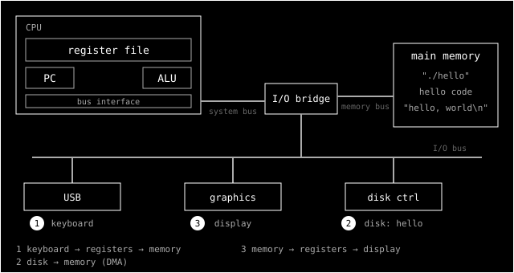

> **Série CSAPP** — notas de leitura de _Computer Systems: A Programmer's Perspective_, uma seção
> por vez. Todos os posts ficam em [#csapp](/tags/csapp/). Anterior:
> [§1.3 — Por que entender o compilador](/posts/csapp-1-3-por-que-entender-compilacao/).
> _[Read in English](/posts/csapp-1-4-the-processor/)._

Até aqui, o `hello` era um arquivo: primeiro texto, depois um executável guardado em disco. Na seção
1.4 ele finalmente roda:

```text
$ ./hello
hello, world
$
```

Quem recebe esse comando é o **shell**, um interpretador de linha de comando. Ele mostra o prompt,
espera você digitar e executa o comando. Se a primeira palavra não for um comando embutido do shell,
ele assume que é o nome de um executável, carrega o programa, roda e espera ele terminar.

Para explicar o que acontece nesse meio-tempo, o livro para e descreve o hardware. Este post cobre a
seção 1.4 inteira, incluindo as subseções 1.4.1 (organização do hardware) e 1.4.2 (rodando o
`hello`).

## O que o livro diz



**Barramentos** são os condutores que levam bytes entre os componentes. Eles transferem blocos de
tamanho fixo chamados **palavras** (_words_). Hoje uma palavra tem 4 bytes (32 bits) ou 8 bytes (64
bits).

**Dispositivos de E/S** ligam o sistema ao mundo externo: teclado, mouse, monitor e o **disco**, onde
o `hello` está guardado. Cada um se conecta ao barramento de E/S por um **controlador** (um chip) ou
por um **adaptador** (uma placa). A diferença é só física: os dois servem para levar dados entre o
barramento e o dispositivo.

A **memória principal** guarda o programa e os dados enquanto ele roda. Fisicamente são chips de
DRAM. Logicamente, é um **array de bytes**, cada um com um endereço que começa em zero.

O **processador** (CPU) interpreta as instruções guardadas na memória. No centro dele está o **PC**
(_program counter_), um registrador que guarda o endereço da próxima instrução. Do momento em que o
computador liga até ser desligado, a CPU repete o mesmo ciclo: lê a instrução para onde o PC aponta,
interpreta os bits, faz uma operação simples e atualiza o PC. As operações são poucas: **load**
(memória → registrador), **store** (registrador → memória), **operate** (dois registradores → ALU →
registrador) e **jump** (um valor da instrução → PC).

O livro faz uma distinção importante aqui. A **ISA** (_instruction set architecture_) descreve o
efeito de cada instrução, num modelo simples em que tudo acontece em sequência. A
**microarquitetura** é como o processador é implementado de verdade, e ela é muito mais complexa. A
CPU _parece_ uma implementação simples da ISA, mas não é.

Com isso, a execução do `hello` acontece em três passos (os números da figura):

1. Enquanto você digita `./hello`, o shell lê cada caractere do teclado para um registrador e o
   guarda na memória.
2. Com o Enter, o shell carrega o executável: código e dados vão do disco para a memória. Com **DMA**
   (_direct memory access_), os bytes vão direto do disco para a memória, sem passar pela CPU.
3. A CPU executa a `main`: os bytes de `hello, world\n` vão da memória para os registradores e de lá
   para o monitor.

## Conferindo na prática

### O PC andando

Com o `gdb` dá para ver o PC (no x86-64, o registrador `%rip`) avançando instrução por instrução:

```text
(gdb) x/3i $pc
=> 0x555555555139 <main>:     sub    $0x8,%rsp
   0x55555555513d <main+4>:   lea    0xec0(%rip),%rdi
   0x555555555144 <main+11>:  call   0x555555555030 <puts@plt>
(gdb) stepi     # $pc: 0x...139 → 0x...13d   (+4)
(gdb) stepi     # $pc: 0x...13d → 0x...144   (+7)
(gdb) x/s $rdi
0x555555556004: "hello, world"
```

O PC avança exatamente o tamanho de cada instrução: 4 bytes, depois 7. É o "interpreta e atualiza o
PC" do livro acontecendo na frente da gente.

### O que "carregar" quer dizer

O livro descreve o carregamento como uma cópia do disco para a memória. Medi isso de outro jeito,
contando _page faults_ com `getrusage` no começo da `main`:

```text
início da main      minor=82 major=0
depois do printf    minor=88 major=0
```

O kernel não copia o executável inteiro antes de começar. Ele **mapeia** o arquivo na memória do
processo, e cada página só é trazida quando a CPU tenta acessá-la pela primeira vez. Cada uma dessas
primeiras vezes é um _page fault_. Foram 82 até chegar na `main`. E **zero** foram _major_, ou seja,
nenhum byte veio do disco: o arquivo ainda estava no cache de páginas do kernel, porque eu tinha
acabado de compilá-lo. O mapa de memória mostra o resultado, com cada parte do executável numa
região com permissões próprias:

```text
0x555555555000-0x555555556000 r-xp  hello      ← código (a única parte executável)
0x555555556000-0x555555557000 r--p  hello      ← "hello, world" (só leitura)
0x7ffff7c24000-0x7ffff7d9f000 r-xp  libc.so.6
```

### O caminho até a tela

O último passo também tem mais camadas do que a figura mostra. Pedi ao `gdb` para parar na chamada de
sistema `write`:

```text
(gdb) catch syscall write
(gdb) run
Catchpoint 1 (call to syscall write), write () from /usr/lib/libc.so.6
(gdb) p $rdi            →  1                    (stdout)
(gdb) x/s $rsi          →  0x555555559010: "hello, world\n"
(gdb) p $rdx            →  13                   (bytes)
(gdb) bt
#4  _IO_flush_all ()
#7  exit ()
```

Duas surpresas. Primeiro, a string não sai da área só de leitura direto para a tela: a libc copia os
bytes para um **buffer no heap** (`0x555555559010`) e só depois pede ao kernel para escrever. Segundo,
como a saída aqui era um pipe e não um terminal, o `write` só aconteceu **dentro do `exit()`**. O
`printf` apenas encheu o buffer, e quem o esvaziou foi o encerramento do programa. Depois disso,
ainda há o kernel, o emulador de terminal (que é outro processo) e a placa de vídeo.

### Mesma ISA, duas máquinas

Este notebook tem um i7-1255U, que é um processador **híbrido**: 2 núcleos de desempenho (P-cores) e
8 núcleos de eficiência (E-cores), com projetos internos diferentes. Os dois rodam exatamente o mesmo
binário, porque implementam a mesma ISA.

Peguei o `sum_ref` e o `sum_local` da [seção 1.3](/posts/csapp-1-3-por-que-entender-compilacao/) e
rodei em cada tipo de núcleo com `taskset`:

| Núcleo | `sum_ref` | `sum_local` |
| ------ | --------- | ----------- |
| P-core | ~510 ms   | ~75 ms      |
| E-core | ~131 ms   | ~130 ms     |

No núcleo "forte", acumular através da memória custa 7x. No núcleo "fraco", não custa nada, e o
`sum_ref` roda **4x mais rápido** que no P-core. Não investiguei qual detalhe do E-core causa isso.
Mas o ponto fica claro: o custo não está no C nem na ISA. Ele está na microarquitetura.

## O computador é um interpretador

Esta é a parte filosófica.

"Ler a próxima instrução, interpretar, executar, avançar" é o mesmo ciclo de um shell, de um REPL,
de uma máquina virtual. A CPU é o interpretador que fica no fundo de todos os outros. O shell que
interpreta `./hello` é, ele mesmo, uma sequência de instruções sendo interpretada pela CPU.

E as instruções ficam na mesma memória que os dados. Isso é o modelo de **programa armazenado** (a
arquitetura de von Neumann), e liga de volta com a [seção 1.1](/posts/csapp-1-1-bits-e-contexto/): o
que faz um byte ser instrução, e não dado, é o PC apontar para ele.

A distinção entre ISA e microarquitetura é a mesma ideia da [seção
1.2](/posts/csapp-1-2-programas-traduzidos/), agora no hardware. O compilador promete que o
comportamento observável é o mesmo, mesmo trocando `printf` por `puts`. A CPU promete que o resultado
é **como se** as instruções rodassem uma por vez, em ordem, mesmo executando várias ao mesmo tempo,
fora de ordem e até antecipando caminhos que talvez nem sejam seguidos. A ISA é um contrato. A
microarquitetura é como o contrato é cumprido.

E contratos vazam. Em 2018, os ataques **Spectre** e **Meltdown** mostraram que efeitos da
microarquitetura (o que ficou no cache depois de uma execução especulativa) podem revelar dados que,
pela ISA, seriam inacessíveis. A abstração estava correta, e ainda assim o detalhe de implementação
era observável.

## Os modelos simplificam

O lado pragmático: o livro avisa que vai omitir detalhes, e é bom ter isso em mente. "Carregar o
programa" na verdade é mapear o arquivo e tratar _page faults_. "Copiar a string para o monitor" na
verdade é buffer da libc, chamada de sistema, kernel, terminal e GPU. O modelo de três passos não está
errado. Ele está na resolução certa para um primeiro contato.

Saber que existe uma resolução maior ajuda a depurar. Quando um `printf` "não aparece" antes de um
crash, o motivo costuma ser o buffer: o programa morreu antes de esvaziá-lo. Quando o primeiro acesso
a um arquivo grande é lento e o segundo é rápido, a diferença costuma ser o cache de páginas.

## O que fica

1. Use o `gdb` para olhar a máquina: `x/i $pc`, `stepi`, `info proc mappings`, `catch syscall`. Ele
   mostra o modelo do livro funcionando.
2. A ISA diz o que acontece. A microarquitetura diz quanto custa. Para desempenho, a segunda
   importa tanto quanto a primeira.
3. Saída em buffer é a explicação mais comum para "o print sumiu". Use `fflush` ou escreva em
   `stderr` quando a ordem importar.

Próxima parada: [1.5](/posts/csapp-1-5-caches-importam/), sobre o fato de que a maior parte desse
trabalho todo é mover dados de um lugar para outro.
