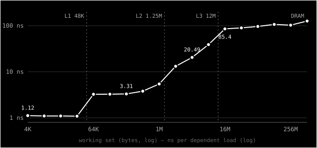

> **Série CSAPP** — notas de leitura de _Computer Systems: A Programmer's Perspective_, uma seção
> por vez. Todos os posts ficam em [#csapp](/tags/csapp/). Anterior:
> [§1.4 — O processador lê e interpreta](/posts/csapp-1-4-o-processador/).
> _[Read in English](/posts/csapp-1-5-caches-matter/)._

Na [seção anterior](/posts/csapp-1-4-o-processador/), o `hello` rodou: o código foi do disco para a
memória e da memória para a CPU, e a string `hello, world\n` foi do disco para a memória e da memória
para a tela. A seção 1.5 tira uma lição desse percurso: **um sistema passa muito tempo movendo
informação de um lugar para outro**.

## O que o livro diz

Do ponto de vista de quem programa, essas cópias são _overhead_: elas atrasam o "trabalho de verdade"
do programa. Por isso, deixá-las rápidas é um dos grandes objetivos de quem projeta sistemas.

O problema é a física. Dispositivos maiores são mais lentos, e dispositivos mais rápidos custam mais
caro. O livro dá a escala:

- O disco pode ser 1.000 vezes maior que a memória principal, mas ler uma palavra do disco pode levar
  **10 milhões de vezes** mais tempo.
- O _register file_ guarda algumas centenas de bytes, contra bilhões na memória, mas a CPU lê dele
  cerca de **100 vezes** mais rápido.

E essa diferença entre processador e memória só cresce, porque é mais fácil e barato deixar
processadores mais rápidos do que memórias.

A solução são as **caches**: memórias menores e mais rápidas, que guardam o que a CPU provavelmente
vai precisar em breve. A **L1** fica no próprio chip, guarda dezenas de milhares de bytes e é quase
tão rápida quanto os registradores. A **L2** é maior (centenas de milhares a milhões de bytes) e umas
5 vezes mais lenta que a L1, mas ainda 5 a 10 vezes mais rápida que a memória principal. Sistemas
mais novos têm uma **L3**. As caches usam SRAM, e a memória principal usa DRAM.

O que faz isso funcionar é a **localidade**: a tendência dos programas de acessar dados e código em
regiões próximas. Com caches, o sistema consegue o efeito de uma memória que é ao mesmo tempo grande e
rápida.

A seção termina com o que os autores chamam de uma das lições mais importantes do livro: quem conhece
as caches consegue deixar seus programas **uma ordem de grandeza** mais rápidos.

## Medindo os degraus

Quis ver essa hierarquia na minha máquina. O teste é uma lista encadeada em ordem aleatória, com um
nó por linha de cache (64 bytes). Cada leitura depende da anterior, porque o próximo endereço só é
conhecido quando o nó atual chega. Assim a CPU não consegue adiantar nada, e o tempo de cada passo
é a latência pura da memória. Variei o tamanho da lista de 4 KiB até 512 MiB, num P-core do
i7-1255U (L1 de 48 KiB, L2 de 1,25 MiB, L3 de 12 MiB):



| Tamanho     | ns por acesso | Onde os dados cabem |
| ----------- | ------------- | ------------------- |
| 4–32 KiB    | ~1,1          | L1                  |
| 64–512 KiB  | ~3,3          | L2                  |
| 2–8 MiB     | 13–39         | L3                  |
| 16 MiB      | 85            | DRAM                |
| 128–512 MiB | 100–126       | DRAM                |

Os degraus aparecem exatamente nos tamanhos das caches. Da L1 para a DRAM, o mesmo `p = p->next`
fica **cerca de 100 vezes** mais lento. A subida dentro da L3 (de 13 para 39 ns) eu ainda não sei
explicar direito. Meu palpite é a tradução de endereços (TLB), que é assunto do capítulo 9.

## Linhas e colunas

O segundo teste é o clássico. Uma matriz de 4096 × 4096 `int` (64 MiB), somada de dois jeitos:

```c
for (int i = 0; i < N; i++)        // por linhas
    for (int j = 0; j < N; j++)
        s += m[i][j];

for (int j = 0; j < N; j++)        // por colunas
    for (int i = 0; i < N; i++)
        s += m[i][j];
```

Em C, as linhas ficam contíguas na memória. Somar por linhas lê os bytes na ordem em que estão. Somar
por colunas salta 16 KiB a cada acesso, e cada salto cai numa linha de cache diferente.

| Flags | Por linhas | Por colunas | Diferença |
| ----- | ---------- | ----------- | --------- |
| `-O1` | ~6 ms      | ~205 ms     | ~35x      |
| `-O2` | ~4 ms      | ~60 ms      | ~8–15x    |

As mesmas 16 milhões de somas, o mesmo resultado. Só muda a ordem. O livro promete "uma ordem de
grandeza", e aqui deu mais que isso.

## Computar é barato, mover é caro

Esta é a parte filosófica.

Uma soma leva menos de um nanossegundo. Buscar o operando na DRAM leva cem. Quando a gente pensa em
"o computador trabalhando", imagina cálculo, mas na maior parte do tempo ele está **esperando dados
chegarem**. É como uma pessoa que lê muito rápido mas precisa ir à biblioteca buscar cada página.

A hierarquia não é uma escolha de engenharia que poderia ser diferente. Ela vem da física: sinais
levam tempo para percorrer distâncias, memória grande ocupa área, e área fica longe do centro. Uma
memória grande _precisa_ estar longe, e o que está longe é lento.

Uma cache, então, é uma **aposta de que o passado prevê o futuro**. Ela guarda o que foi usado agora
(localidade temporal) e os vizinhos do que foi usado (localidade espacial), apostando que você vai
voltar a eles. E a aposta costuma dar certo, porque programas, como pessoas, têm hábitos. A mesa de
trabalho guarda os livros abertos, a estante guarda os da semana, a biblioteca guarda o resto.
Ninguém vai à biblioteca a cada frase.

Isso também diz algo sobre as abstrações que vimos até aqui. Na [seção
1.4](/posts/csapp-1-4-o-processador/), a memória era "um array de bytes, cada um com seu endereço".
É uma abstração útil, mas esconde que um endereço pode custar 1 ns ou 100 ns dependendo de onde o dado
está. Todos os endereços parecem iguais. Não são.

## Big-O não conta tudo

O lado pragmático: as duas somas da matriz são O(n²). Pela análise de complexidade, são o mesmo
algoritmo. Na prática, uma é 35 vezes mais lenta que a outra. A constante que a notação esconde é,
muitas vezes, a memória.

Algumas consequências do dia a dia:

- **Arrays costumam vencer listas encadeadas**, mesmo quando a teoria diz o contrário, porque arrays
  são contíguos e listas espalham os nós pela memória.
- **A ordem dos loops importa.** Percorra os dados na ordem em que estão guardados.
- **Struct of arrays vs array of structs.** Se um loop só usa um campo, guardar esse campo
  contíguo traz para a cache só o que vai ser usado.
- **Dados menores são dados mais rápidos.** Um `int32` no lugar de um `int64` faz caber o dobro de
  valores em cada linha de cache.

## O que fica

1. Pense em quanto dado o seu loop toca e onde ele cabe: L1, L2, L3 ou DRAM. O desempenho muda em
   degraus, não de forma contínua.
2. Acesse a memória em ordem. Acesso sequencial é o caso que todo o hardware foi feito para
   acelerar.
3. Meça. Os números deste post são da minha máquina. Os da sua serão outros, mas os degraus vão
   estar lá.

Próxima parada: 1.6, onde a ideia de cache vira uma hierarquia inteira de dispositivos de
armazenamento.
