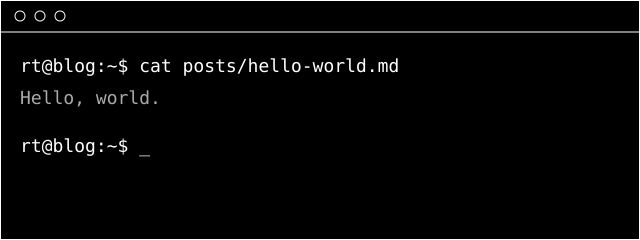

This is the first post. The blog is a static site built with [Astro](https://astro.build), written in
Markdown and published to GitHub Pages. The look borrows from the terminal: one monospaced font,
black and white, and nothing that gets in the way of the text.

## Why a terminal look

Because the content is the point. No colors fighting for attention, no sidebars, no pop-ups.

> Simplicity is prerequisite for reliability. — Edsger W. Dijkstra

## Code

Code blocks are highlighted in grayscale — structure through weight and shade, never hue:

```ts
// group posts by year, newest first
export function groupByYear(posts: Post[]) {
  const groups = new Map<number, Post[]>();
  for (const post of posts) {
    const year = post.data.date.getUTCFullYear();
    groups.set(year, [...(groups.get(year) ?? []), post]);
  }
  return [...groups];
}
```

### Images

Images live next to the post and are optimized at build time:



## What's next

- writing about tools I use daily
- notes on software design
- the occasional rabbit hole
